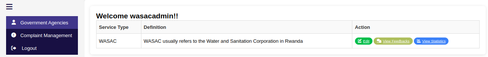

# Citizen Complaints and Engagement System (MVP)

---

---
## Overview

The **Citizen Complaints and Engagement System** is a robust, user-friendly platform designed to empower citizens by simplifying the process of submitting, tracking, and resolving public service complaints. This MVP (Minimum Viable Product) aims to foster transparent communication between citizens and public service administrators, enhancing community engagement and improving government accountability.

---

## Key Features

- 📝 **Complaint Submission:** Citizens can easily submit complaints with detailed descriptions related to public services.
- 🔍 **Complaint Tracking:** Real-time status updates allow citizens to track the progress of their complaints.
- 👥 **Admin Dashboard:** Service administrators get a dedicated dashboard to manage complaints, view statistics, and respond effectively.
- 🔐 **Secure Access:** Password verification ensures only authorized service admins access sensitive complaint data.
- 💬 **Feedback System:** Citizens can provide feedback on service resolution, closing the engagement loop.
- 📊 **Statistics & Reporting:** Admins can view summarized complaint stats — total, resolved, and pending cases.
- ⚙️ **Role-Based Access Control:** Separate roles for citizens and service admins for tailored experiences.
  
---

## Application Dashboards

Below are screenshots and demo videos showcasing the main dashboards of the application.

---

### 1. Admin Dashboard

  
  
  

*The Admin Dashboard provides an overview of citizens, Government Agencies with complaints and feedbacks, status tracking, and quick actions.*

---

### 2. Service Admin Dashboard

  
  
  

*The Service Admin Dashboard provides an overview of complaints and their statistics, status tracking, and quick actions.*

---

### 3. Citizen Dashboard

  
  
  

*Citizens can view their own submitted complaints, submit new ones, and track their status in real time.*

---

**Demo:**

---
## Technology Stack

- **Backend:** Django (Python)
- **Frontend:** HTML, CSS, Bootstrap, and Font Awesome
- **Database:** PostgreSQL
- **Authentication:** Django's built-in authentication system
- **Deployment:** Ready for server deployment (can be extended with Docker, Nginx, etc.)

---

## Installation & Setup

Follow these steps to set up and run the Citizen Complaints and Engagement System locally:

### 1. Clone the repository and navigate into it
git clone https://github.com/imalexianne/citizen-complaints.git
cd citizen-complaints

### 2. Create and activate a virtual environment
python3 -m venv venv
source venv/bin/activate   # Windows: venv\Scripts\activate

### 3. Install dependencies
pip install -r requirements.txt

### 4. Setup PostgreSQL database (run in terminal)
sudo -u postgres psql
CREATE DATABASE citizen_complaints_db;
CREATE USER your_db_user WITH PASSWORD 'your_password';
ALTER ROLE your_db_user SET client_encoding TO 'utf8';
ALTER ROLE your_db_user SET default_transaction_isolation TO 'read committed';
ALTER ROLE your_db_user SET timezone TO 'UTC';
GRANT ALL PRIVILEGES ON DATABASE citizen_complaints_db TO your_db_user;
\q

### 5. Update DATABASES settings in your Django settings.py file:
DATABASES = {
    'default': {
       'ENGINE': 'django.db.backends.postgresql',
        'NAME': 'citizen_complaints_db',
        'USER': 'your_db_user',
        'PASSWORD': 'your_password',
        'HOST': 'localhost',
        'PORT': '5432',
    }
}

### 6. Apply database migrations
python manage.py migrate

### 7. Create a superuser for admin access
python manage.py createsuperuser

### 8. Run the development server
python manage.py runserver

## Future Features

- 📱 **Mobile App Integration:** Provide mobile support for easier access and complaint submission on the go.
- 🌍 **Multi-language Support:** Support for multiple languages to ensure inclusivity and accessibility.
- 🔔 **Email & SMS Notifications:** Notify users about complaint status changes and admin responses.
- 🤝 **Community Forums:** Allow discussion and upvotes on common issues among citizens.
- 📈 **AI-Powered Insights:** Analyze complaint trends and citizen sentiments using machine learning.

---

## Acknowledgements

- 🙏 Special thanks to [**MINICT**](https://www.minict.gov.rw), [**RISA**](https://www.risa.rw), and the [**Rwanda ICT Chamber**](https://www.ictchamber.rw/) for organizing the **Tech Associates Hackathon**, where this project was conceptualized and developed.

- Inspired by the need for **transparent governance** and **active civic engagement**.
- Built with ❤️ by **Alexianne Imanirakarama.**.
- Icons by [Font Awesome](https://fontawesome.com/), UI elements by [Bootstrap](https://getbootstrap.com/).

---

## Contact

Alexianne Imanirakarama.  
Kigali, Rwanda  
📧 Email: imalexianne@gmail.com  
📞 Phone: +250 783351129  
🔗 GitHub: [@imalexianne](https://github.com/imalexianne)

---

